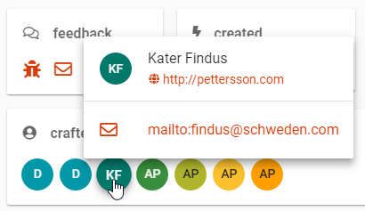

# npmFrog

> > A nice npmjs.org-like web interface for jFrog Artifactory

To share frontend code inside your company between different projects and developers, you can use a private npm registry like Verdaccio or jFrog's Artifactory (which is often used for Maven dependency management in the Java Environment).
The latter lacks of a good UI for web devlopers, so npmFrog will present you the self-hosted packages of your company in a more familiar and discoverable way.

It's free and open source.





## Installation

```bash
npm i -g npmfrog
```

Duplicate the file `.SAMPLE.npmfrogrc.json` and rename it to `.npmfrogrc.json` (either leave it in the project directory or put it in your home directory).

## Usage

```bash
npmfrog
```

Browse to npmFrog instance [http://localhost:8000](http://localhost:8000).

### Development

```bash
npm run dev
```

With local environment (no internet connection needed):

```bash
npm start
```

To see the logs, run

```bash
npm run logs
```

Stop all running background processes:

```bash
npm stop
```
