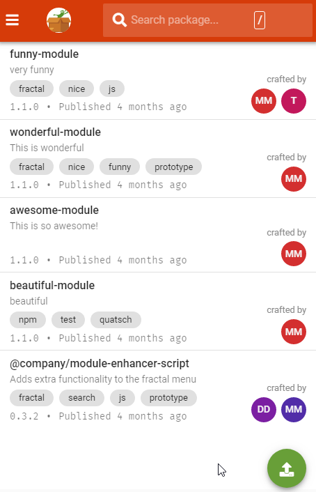
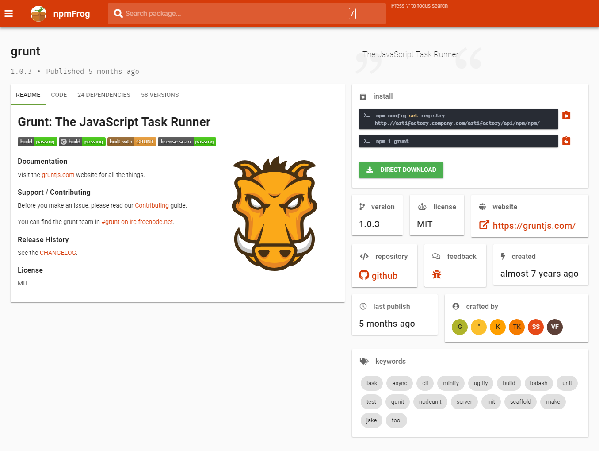
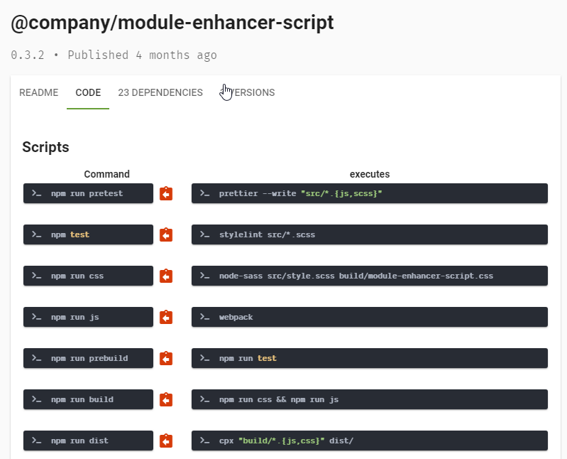
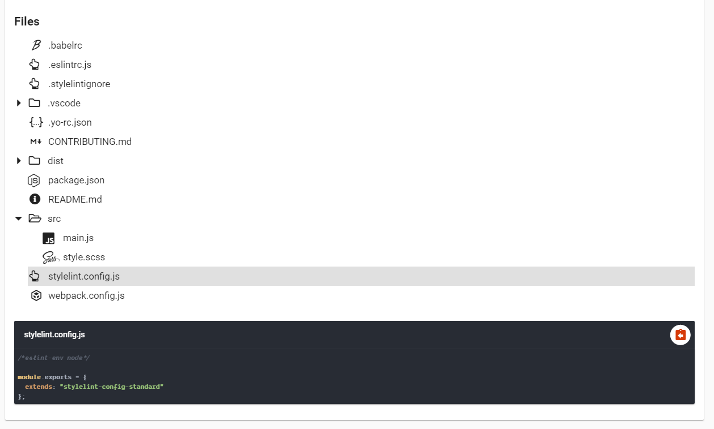
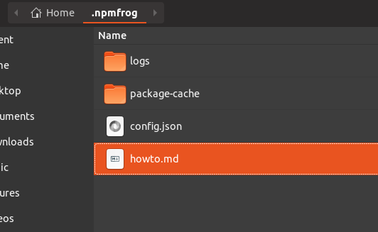

# npmFrog

> A nice npmjs.org-like web interface for JFrog Artifactory

To share code in your company or team between different projects and developers, you can use a private npm registry like [Verdaccio](https://verdaccio.org/) or [JFrog's Artifactory](https://www.jfrog.com/confluence/display/RTF/Npm+Registry) (which is often used for Maven dependency management in the Java Environment).
The latter lacks a good UI for web developers, so npmFrog is here to present you the self-hosted packages of your team in a more familiar and discoverable way.

👐 It's free and open source. :)


> *The homepage: an overview list of your packages.*

---


> *The awesome package search: lookup tags, crafters and packages.*

---


> *Every package has a detail page to view a lot of useful meta information. Even the remote-cache packages.*

---


> *Get details about the people who crafted the package to contact them or to search for other packages by the same author.*

---


> *An overview table of all npm scripts in the `package.json`.*

---


> *Inspect files that are contained in the package and view or download its code.*


## Prerequisites

- [Node.js >= 8.x](https://nodejs.org/en/download/)
- JFrog Artifactory is running somewhere in your company's network

## Installation

```bash
npm i -g npmfrog
```

## Usage

### Start

```bash
npmfrog
```

Browse to npmFrog instance [http://localhost:8000](http://localhost:8000).

### Stop

```bash
npmfrog stop
```

### Show logs

```bash
npmfrog logs
```

### Configuration

At the first startup, npmFrog will create a configuration file in your home directory under `~/.npmfrog/config.json`. Please fill this file with your artifactory properties.

If you want to add additional text in the `/howto` section, you can create a `howto.md` file in the `~/.npmfrog` directory with some additional [markdown](https://www.markdownguide.org/) content.



If you want to hide the default publishing guide under `/howto`, set `howto.default` in the `config.json` file to `false`.

```json
  "howto": {
    "default": false
  }
```

### Development

```bash
npm run dev
```

With a local environment (no internet connection needed):

```bash
npm start
```

To see the logs, run

```bash
npm run logs
```

Stop all running background processes:

```bash
npm stop
```

See the status of background processes:

```bash
npm run ps
```
